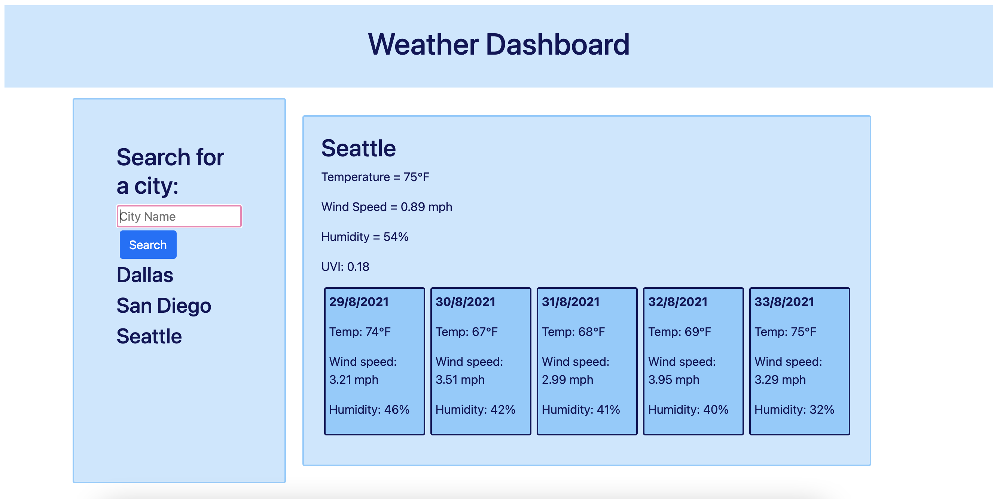

# Weather Dashboard

# by Charlotte Clark

## User Story

```
AS A traveler
I WANT to see the weather outlook for multiple cities
SO THAT I can plan a trip accordingly
```

## Acceptance Criteria

This weather dashboard allows user to input cities and see up-to-date weather and forecast for the upcoming five days.
When the user searches for a city, they are then presented with current and future conditions for that city and that city is added to the search history.
The user is presented with the city name, the date, an icon representation of weather conditions, the temperature, the humidity, the wind speed, and the UV index
Future weather conditions for that city are also displayed, with a 5-day forecast that displays the date, an icon representation of weather conditions, the temperature, the wind speed, and the humidity.
Clicking on a city in the search history will re-present current and future conditions for that city.


https://charlocc.github.io/weatherdashboard/
--- 


## Licensing
The MIT License (MIT)

Copyright (c) 2021 Charlotte Clark

Permission is hereby granted, free of charge, to any person obtaining a copy of this software and associated documentation files (the "Software"), to deal in the Software without restriction, including without limitation the rights to use, copy, modify, merge, publish, distribute, sublicense, and/or sell copies of the Software, and to permit persons to whom the Software is furnished to do so, subject to the following conditions:

The above copyright notice and this permission notice shall be included in all copies or substantial portions of the Software.

THE SOFTWARE IS PROVIDED "AS IS", WITHOUT WARRANTY OF ANY KIND, EXPRESS OR IMPLIED, INCLUDING BUT NOT LIMITED TO THE WARRANTIES OF MERCHANTABILITY, FITNESS FOR A PARTICULAR PURPOSE AND NONINFRINGEMENT. IN NO EVENT SHALL THE AUTHORS OR COPYRIGHT HOLDERS BE LIABLE FOR ANY CLAIM, DAMAGES OR OTHER LIABILITY, WHETHER IN AN ACTION OF CONTRACT, TORT OR OTHERWISE, ARISING FROM, OUT OF OR IN CONNECTION WITH THE SOFTWARE OR THE USE OR OTHER DEALINGS IN THE SOFTWARE.
